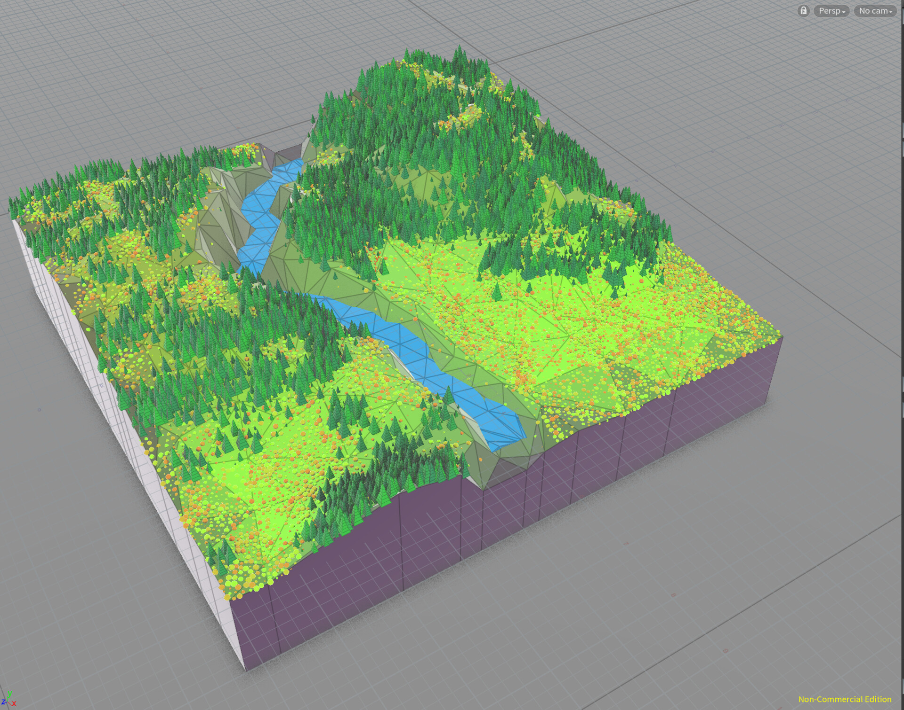
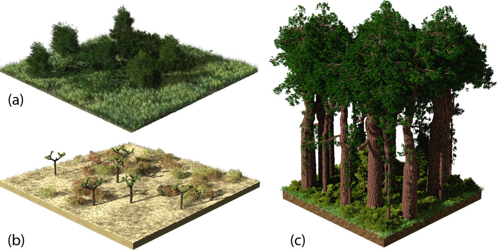

# `Eden` - Short Game Design Document
## Creat de: `Catalin Plesu`

> *This document is a quick overview of the game design decisions of the game `Eden` (this is a short version of the usual Game Design Document).*

## Story

`Actiunea are loc într-o pădure masivă.`

## Characters

`Interaționăm cu lumea prin ochii unui caracter necunoscut la persoana 1.`

## Visual Arts

`Jocul va avea grafica 3D.`

`O mare parte din lume va fi generata procedural.`

Exemplu de teren generat procedural


Exemplu de plante generate procedural


Imaginile folosite nu sunt generate de mine.

## Sound Effects (SFX) & Music

`În joc nu va fi prezentă muzică, doar sunete care pot fi gasite în natură.`

[Link sunete](https://mixkit.co/free-sound-effects/forest/)

## Gameplay Features

`Poate explora padurea, strângând diverse alimente pentru a nu muri de foame. Totodata va evita animalele periculoase care îl pot ataca.`

## Level Design (LD)

`Joaca este cu lumea deschisă, jocul este castigat cand jucatorul gaseste un copac cu niste ` fructe interzise

## User Interface (UI)

`Înafara de meniul de la începutul jocului nu va fi prezentă interfața grafică pentru a nu distrage jucătorul de la joc.`

## Game Controls

`Control ca în majoritatea jocurilr cu taste 'wasd' și mouse.`

## Target Platform / Minimum Hardware:
```
Jocul va fi compilat pentru:
- Linux
- Windows
Pentru o experienta placuta va fi nevoie de minimum:
- 8 RAM
- 1 VRAM
- Intel i3 
- 500 MB spatiu de stocare
```

## Team
`Singurul membru al echipei sun eu`

Voi avea îndatoriri de:
- Designer
- Artist
- Programator
- Tester

## Time
Dezvoltarea jocului a început pe `21.02.2022` și se va finisa pe `15.04.2022`.
În total vor fi 40 de zile lucrătoare, pentru a reuși trebuie să folosesc o tehnică
Agilă de dezvoltare care va permite să rezolv rapid problemele care pot apărea.

Considerând că majoritatea jocurilor dureza câțiva ani și au echipe de sute de 
persoane nu pot fi foarte ambițios, si trebuie să am așteptări realiste.
